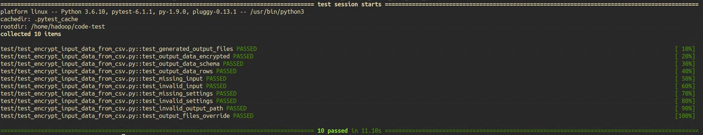

# Coding challenges

## Data processing
### Requirements
- Generate a csv file containing first_name, last_name, address, date_of_birth
- Process the csv file to anonymise the data
- Columns to anonymise are first_name, last_name and address
- Can work on bigger dataset
### Solutions
- Picked AWS EMR PySpark as dev environment
- Encrypted PII data using sha256
- Configurations are stored separately in a settings file
- Unit tested and all passed

